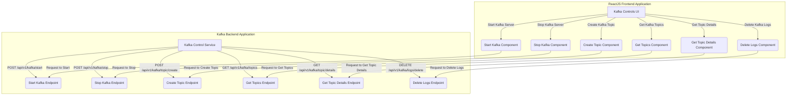
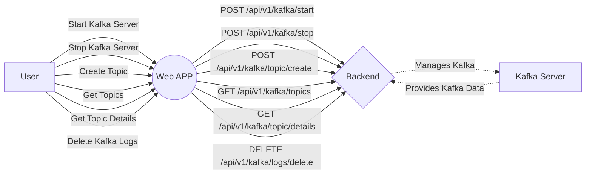
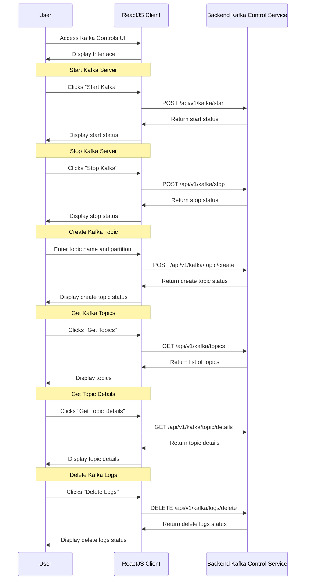

# 📌 react-kafka-manager-ui

## Table of Contents

- [Overview](#overview)
- [Features](#features)
- [Application Flow](#application-flow)
- [Flowchart Diagram](#flowchart-diagram)
- [Backend Application: Kafka Control Service](#backend-application-kafka-control-service)
- [Frontend Application: kafka-controls-ui](#frontend-application-kafka-controls-ui)
- [Installation](#installation)
- [Usage](#usage)
- [Contributing](#contributing)
- [License](#license)
- [Acknowledgements](#acknowledgements)
- [Author](#author)

## 🚀 Overview

Kafka Controls UI is a web application built using ReactJS for managing Kafka clusters. It allows users to start and stop Kafka servers, create and delete Kafka topics, get Kafka topic details, and delete Kafka logs through a simple and intuitive interface.

## Features

- **Start Kafka Server:** Start the Kafka server with a click of a button.
- **Stop Kafka Server:** Stop the Kafka server easily.
- **Create Kafka Topic:** Create new Kafka topics by specifying the name and optionally the number of partitions.
- **Delete Kafka Logs:** Delete Kafka logs for cleanup.
- **Get Kafka Topics:** Retrieve and display a list of available Kafka topics.
- **Get Topic Details:** Fetch and display the details of a specific Kafka topic.

## Application Flow



## Flowchart Diagram



## Sequence Diagram



## Backend Application: spring-boot-kafka-storage-service

The backend application, named `spring-boot-kafka-manager-service`, provides the following endpoints:

- App Name - spring-boot-kafka-storage-service
- Platform - Java Spring Boot

- **Start Server** POST `/api/v1/kafka-service/kafka/start-server`
- **Stop Server** POST `/api/v1/kafka-service/kafka/stop-server`
- **Create Topic** POST `/api/v1/kafka-service/kafka/create-topic`
- **Get All Topics** GET `/api/v1/kafka-service/kafka/topic`
- **Get Topic Details** GET `/api/v1/kafka-service/kafka/topic/details`
- **Delete Kafka LOgs** DELETE `/api/v1/kafka-service/kafka/topic`


Backend Code Repository URL:

```bash
git clone https://github.com/siddhantpatni0407/spring-boot-kafka-manager-service.git
```

## Frontend Application: react-file-storage-ui

The frontend application, named `react-kafka-manager-ui`, is built using ReactJS.


## Installation

To run this project locally, follow these steps:

1. Clone the repository:

    ```bash
    git clone https://github.com/siddhantpatni0407/react-kafka-manager-ui.git
    ```

2. Navigate to the project directory:

    ```bash
    cd file-storage-system
    ```

3. Install dependencies:

    ```bash
    npm install
    ```

4. Install axios for making HTTP requests:

    ```bash
    npm install axios
    ```

5. Install Bootstrap for styling:

    ```bash
    npm install bootstrap@5.3.3
    ```

6. Install Font Awesome for icons:

    ```bash
    npm install @fortawesome/fontawesome-free@6.5.1
    npm install @fortawesome/free-solid-svg-icons@6.5.1
    npm install @fortawesome/react-fontawesome@0.2.0
    ```

7. Start the development server:

    ```bash
    npm start
    ```

8. Open your web browser and go to [http://localhost:3000](http://localhost:3000) to view the app.


## Usage

- **Start Kafka Server:** Click on the "Start Kafka" button to start the Kafka server.
- **Stop Kafka Server:** Click on the "Stop Kafka" button to stop the Kafka server.
- **Create Kafka Topic:** Enter the topic name and optional partition number to create a new Kafka topic.
- **Get Kafka Topics:** Click on "Get Topics" to retrieve and display a list of Kafka topics.
- **Get Topic Details:** Enter the topic name to get details for that specific topic.
- **Delete Kafka Logs:** Click "Delete Logs" to delete Kafka logs.


## Contributing

Contributions are welcome! Please follow these steps to contribute:

1. Fork the repository.
2. Create a new branch: `git checkout -b feature/my-feature`.
3. Make your changes and commit them: `git commit -am 'Add some feature'`.
4. Push to the branch: `git push origin feature/my-feature`.
5. Submit a pull request.

## License

This project is licensed under the MIT License. See the [LICENSE](LICENSE) file for details.

## Acknowledgements

- [React](https://reactjs.org/)
- [Bootstrap](https://getbootstrap.com/)
- [FontAwesome](https://fontawesome.com/)

## Author

Siddhant Patni